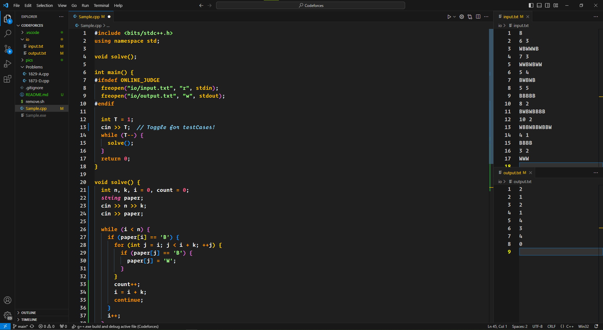

<h1 align="center">
  Competitive Programming Setup
</h1>

<div align="center">

  
  
  

</div>
<p align="center">
  
</p>

<p align="center">
  
  
  
</p>

This is not an official project. It is made by Me, While i was practising `Competitive Programming` .

## 🤫 Benifits
- [x] IntelliSense Supported by Microsoft C/C++ Extentionpack.
- [x] Included `bits/stdc++.h` header file.
- [x] Organised folder system to save problems seperately.
- [x] 2min or less setup instruction.


## 🤔 What You Need Before Clone!

  1. We need `MINGW` So headover to [CodeBlocks](https://www.codeblocks.org/downloads/binaries/) & Download `codeblocks-x.xmingw-nosetup.zip` and Extract it. You will get an `MinGW` folder.

  2. Copy the `MinGW` folder to `C:\MinGW`. Edit the Enviornment Variable so that our System can find `g++` compiler in the path. You can google this step.

## bits/stdc++.h Header file

We need `bits/stdc++.h` header file for the competition. Do the following steps:

- Download And Extract [stdc++](https://gist.github.com/Einstrasse/ac0fe7d7450621a39364ed3b05cacd11) file. Rename it to `stdc++.h`
- Copy the file to `C:\MinGW\lib\gcc\x86_64-w64-mingw32\8.1.0\include\c++\bits`
- `Shift + Right Mouse Button` select `Open Powershell Window Here!`
- Compile the `stdc++.h` file.

    ```bash
    g++ -std=c++17 stdc++.h
    ```

**Now We are Ready To Clone and Code! **

## ✨ Quick start

1.  **Clone this repository.**

    ```sh
    git clone https://github.com/zhshakib/competetive-setup.git
    ```

2. Open the folder with Visual Studio Code.

3. Install Recommended Extensions
   - [x] [Code Runner](https://marketplace.visualstudio.com/items?itemName=formulahendry.code-runner)

   - [x] [C/C++ by Microsoft](https://marketplace.visualstudio.com/items?itemName=ms-vscode.cpptools)

4. Lets make the view like bellow.

  

5. Open `Sample.cpp` file, Solve a problem then  Hit <kbd>`F5`</kbd> To Run and Debug the file.

## 🧐 What's inside this repo!


    ├── .vscode
      ├── c_cpp_propertise.json
      ├── extensions.json
      ├── launch.json
      ├── tasks.json
    ├── io
      ├── input.txt
      ├── output.txt
    ├── Pics
    ├── Problems
    ├── README.md
    ├── remove.sh
    ├── Sample.cpp


**`.vscode`**: Config files for Running C++, Also have recommended Extensions.

**`/io`**: `Input.txt` and `Output.txt` for testing with the `codeforces` Test Cases.

**`/Problems`**: All the solved problem will be here with their id name!

**`remove.sh`**: Bash Script to remove all the `.exe` file which will be generated!

**`README.md`**: THIS File 😆

**`Sample.cpp`**: Sample C++ File where You will spend the most of your time! ✌


## 😽 Thanks A Lot!
I am always ready to merge Your PR. Feel free to write issues. Thanks a Lot!
<div align="center">

  <!-- badges: start -->
  
  
  
  
  
  
  

</div>
